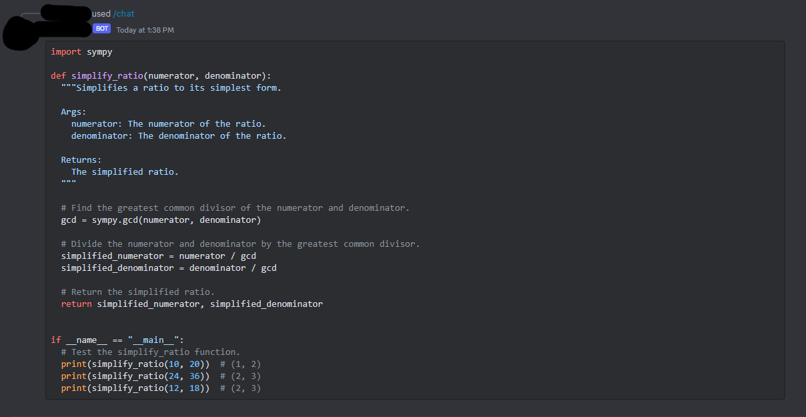

<p align="center">
  
</p>

<p align="center">
  
  
</p>

<p align="center">
  
  
</a>
</p>

<p align="center"><b>Discord based AI chat environment using the Gemini 1.0 AI by Google.</b></p>

##

### Features:

 - Latest Discord Bot Command System
 - Gemini 1.0 AI Model

#### Tested on
 - `Termux`
 - `Ubuntu`
 - `Kali-Linux`
 - `Windows 10/11`

### Installation

##### Install dependencies (git, python)
 - For Debian
    ```
    sudo apt install git python3 -y
    ```
 - For Termux
    ```
    pkg install git python3  -y
    ```
##### Download Project
 -  Clone this repository
    ```
    git clone https://github.com/jhockersmith/Discord-Gemini-AI
    ```

 - Enter the directory
    ```
    cd Discord-Gemini-AI
    ```

 -  Install all modules
    ```
    pip install -r requirements.txt
    ```

 -  Run the tool
    ```
    python main.py
    ```
##### Using the AI
Within Discord:
 -  Type the following command, followed by your prompt
    ```
    /chat [prompt]
    ```
 -  Example Command
    ```
    /chat Please generate a Python script that simplifies ratios. 
    ```
    Example Output:
<p align="center">
  
</p>
##

#### Check out my other projects:
 - [DiscordGPT](https://github.com/byestumpy/DiscordGPT) - A Discord based ChatGPT (Without censorship)

## Disclaimer
***This tool is developed for educational purposes. You have your own responsibilities and you are liable to any damage or violation of laws by this tool. The author is not responsible for any misuse of IcePick!***

### This repository is open source to help others. So if you wish to copy, consider giving credit!

